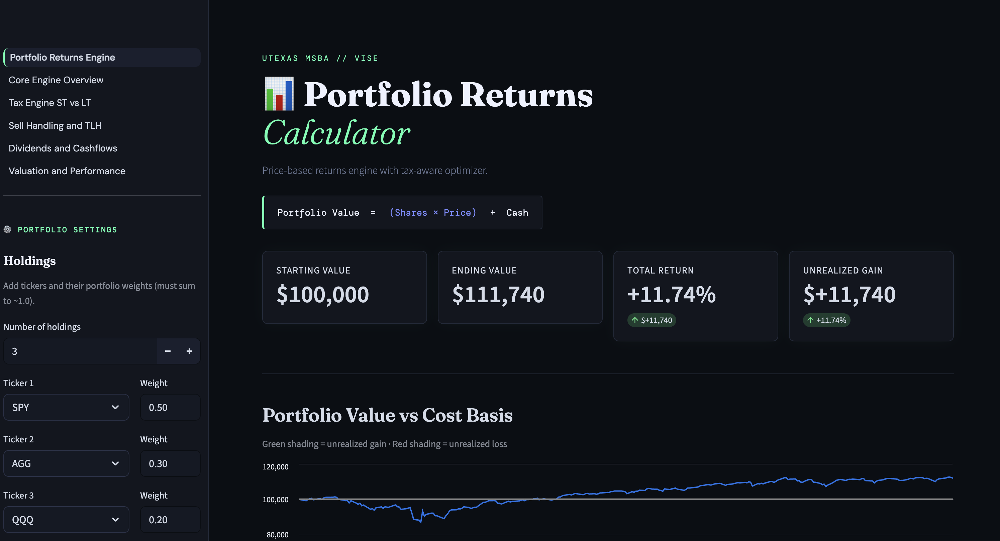

# 📊 Streamlit Trade TLH Optimizer

### Tax-Aware Portfolio Simulation & Optimization Engine

---

## Overview

The Streamlit Trade TLH Optimizer is an interactive portfolio analytics platform designed to simulate investment performance under rebalancing and tax-loss harvesting strategies.

Developed as part of the **UT Austin MSBA Vise Capstone**, this tool provides a production-style interface for testing portfolio allocation decisions, evaluating tax-aware optimization logic, and visualizing return dynamics across multiple strategy configurations.

Unlike notebook-based workflows, this system exposes portfolio logic through a structured UI intended to resemble institutional portfolio analytics tooling.

---

## Core Capabilities

### Portfolio Simulation Engine

* Historical price-based portfolio return calculation
* Multi-asset support (ETFs, equities, bonds)
* Weighted allocation modeling

### Rebalancing Framework

Supports configurable rebalance frequencies:

* Daily
* Weekly
* Monthly
* Quarterly

Automatically tracks:

* Holdings drift
* Trade execution
* Allocation restoration

---

### Tax-Loss Harvesting Logic

The optimizer includes a tax-aware simulation layer that:

* Detects unrealized losses
* Simulates sell-and-replace TLH actions
* Tracks realized gains/losses
* Updates cost basis after trades

This allows users to evaluate the potential tax impact of systematic rebalancing decisions.

---

### Cashflow & Dividend Handling

* Dividend mapping via external dataset
* Cash accumulation between events
* Dividend reinvestment into portfolio weights

---

### Interactive Dashboard (Streamlit)

The UI includes:

* Portfolio configuration panel
* Holdings weight editor
* Strategy toggle controls
* Return comparison outputs
* Performance visualization

Custom styling includes a **Bloomberg-terminal inspired dark theme**.

---

## Architecture

```id="arch1"
User Inputs (Tickers / Weights / Dates)
        ↓
Portfolio Engine
        ↓
Rebalancing Logic
        ↓
Tax Optimization Layer (TLH Engine)
        ↓
Cashflow / Dividend Processing
        ↓
Performance Calculation
        ↓
Streamlit Visualization Layer
```

---

## Repository Structure

```id="arch2"
Streamlit_Trade_TLH_Optimizer/

├── Portfolio_Returns_Engine.py
│   Main Streamlit application entry point
│
├── optimizer_msba_v1_engine.py
│   Core tax-aware optimization logic
│
├── ui_style.py
│   Custom styling and theme overrides
│
├── dividend_data.csv
│   Dividend reference dataset
│
├── requirements.txt
│   Python dependencies
│
├── pages/
│   Additional Streamlit application pages
│
└── .streamlit/
    └── config.toml
```

---

## Installation

Clone repository:

```id="inst1"
git clone <repo-url>
cd Streamlit_Trade_TLH_Optimizer
```

Install dependencies:

```id="inst2"
pip install -r requirements.txt
```

---

## Running the Application

```id="run1"
streamlit run Portfolio_Returns_Engine.py
```

The dashboard will launch in your browser.

---

## Example Workflow

1. Select number of holdings
2. Enter ticker symbols
3. Assign portfolio weights
4. Choose investment horizon
5. Toggle optimizer options
6. Run simulation

The engine will compute:

* Portfolio value trajectory
* Strategy comparison outputs
* Trade counts
* Gain/loss tracking

---

## Technology Stack

* Python
* Streamlit
* Pandas
* NumPy

---

## Intended Use

This system is designed for:

* Portfolio strategy experimentation
* Tax-aware optimization simulation
* Financial analytics demonstrations
* Capstone research deliverables

This project is **not intended for live trading execution**.

---

## Quick Start

### Run locally

```bash
git clone https://github.com/jringler30/portfolio-tlh-optimizer.git
cd portfolio-tlh-optimizer
pip install -r requirements.txt
streamlit run portfolio_returns_engine_code.py
```

Then open the local Streamlit URL shown in the terminal.

---

## Author

Joshua Ringler
MS Business Analytics — University of Texas at Austin

---

## License

MIT License
